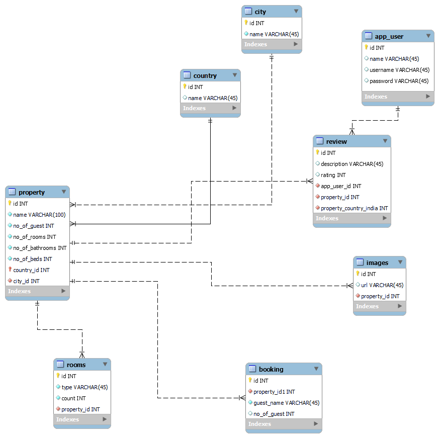

# Venture Stay

VentureStay is a Spring Boot application designed to manage users, properties, and reviews for an online property rental platform. This application provides RESTful APIs to handle the core operations related to users, properties, and reviews.

## Features

- **User Management**: Create, retrieve.
- **Property Management**: Add new properties, retrieve property information.
- **Review Management**: Post reviews for properties.

## Technologies Used

- **Spring Boot**: Backend framework.
- **Spring Data JPA**: For database interactions.
- **H2/MySQL**: In-memory database for development and MySQL for production.
- **Spring Security**: For authentication and authorization.
- **BCrypt**: For password encryption.
- **Lombok**: To reduce boilerplate code.


## ER Diagram


## Endpoints

### Search hotels
```
GET /api/v1/properties/search-hotels?name=goa
```
Response
```json
[
    {
        "id": 3,
        "name": "goa sea view",
        "no_of_guest": 4,
        "no_of_rooms": 2,
        "no_of_bathrooms": 2,
        "no_of_beds": 2,
        "country": {
            "id": 1,
            "name": "india"
        },
        "city": {
            "id": 2,
            "name": "goa"
        }
    }
]
```

### User sign up
```
POST /api/v1/users/signup
```

Payload
```json
{
    "name":"John",
    "username":"john",
    "email":"john@email.com",
    "password":"user_password"
}
```
Response
```json
{
    "id": 4,
    "username": "john",
    "email": "jhon@email.com",
    "name": "John",
    "password": "password_hash",
    "role": "ROLE_USER"
}
```

### User login
```bash
POST http://localhost:8080/api/v1/users/login
```
Payload
```json
{
    "username":"john",
    "password":"john_123$asdf"
}
```
Response
```json
{
    "token": "jwt+token",
    "type": "JWT"
}
```


### Admin signup 
```bash
POST http://localhost:8080/api/v1/users/signup-admin
```
Payload
```json
{
  "name":"Stan",
  "username":"stan",
  "email":"stan@gamil.com",
  "password":"stan1234"
}
```
Response
```json
{
  "id": 5,
  "username": "stan",
  "email": "stan@gamil.com",
  "name": "Stan",
  "password": "password_hash",
  "role": "ROLE_ADMIN"
}
```

### Property Owner Signup
```bash
POST http://localhost:8080/api/v1/users/signup-property-owner
```
Payload
```json
{
  "name":"Zoya",
  "username":"zoya",
  "email":"zoya@gamil.com",
  "password":"zoya123"
}
```
Response
```json
{
  "id": 6,
  "username": "zoya",
  "email": "zoya@gamil.com",
  "name": "Zoya",
  "password": "password_hash",
  "role": "ROLE_OWNER"
}
```


### Add Country
```bash
POST http://localhost:8080/api/v1/country/addCountry
```
Headers
```
Authorization: token
```
Response
```json
{
  "id": 4,
  "username": "jhon",
  "email": "jhon@email.com",
  "name": "John",
  "password": "password_hash",
  "role": "ROLE_USER"
}
```

### Property review
```bash
POST http://localhost:8080/api/v1/review?propertyId=3
```
Headers
```
Authorization: token
```

Response
```json
{
  "id": 8,
  "rating": 4,
  "description": "very nice hotel",
  "appUser": {
    "id": 4,
    "username": "jhon",
    "email": "jhon@email.com",
    "name": "John",
    "password": "password_hash",
    "role": "ROLE_USER"
  },
  "property": {
    "id": 3,
    "name": "goa sea view",
    "no_of_guest": 4,
    "no_of_rooms": 2,
    "no_of_bathrooms": 2,
    "no_of_beds": 2,
    "country": {
      "id": 1,
      "name": "india"
    },
    "city": {
      "id": 2,
      "name": "goa"
    }
  }
}
```

### User Review
```bash
GET http://localhost:8080/api/v1/review/user/review
```
Headers
```
Authorization: token
```

Response
```json
[
  {
    "id": 8,
    "rating": 4,
    "description": "very nice hotel",
    "appUser": {
      "id": 4,
      "username": "jhon",
      "email": "jhon@email.com",
      "name": "John",
      "password": "password_hash",
      "role": "ROLE_USER"
    },
    "property": {
      "id": 3,
      "name": "goa sea view",
      "no_of_guest": 4,
      "no_of_rooms": 2,
      "no_of_bathrooms": 2,
      "no_of_beds": 2,
      "country": {
        "id": 1,
        "name": "india"
      },
      "city": {
        "id": 2,
        "name": "goa"
      }
    }
  }
]
```